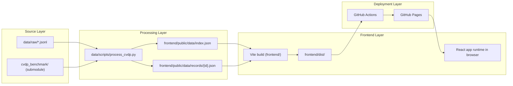
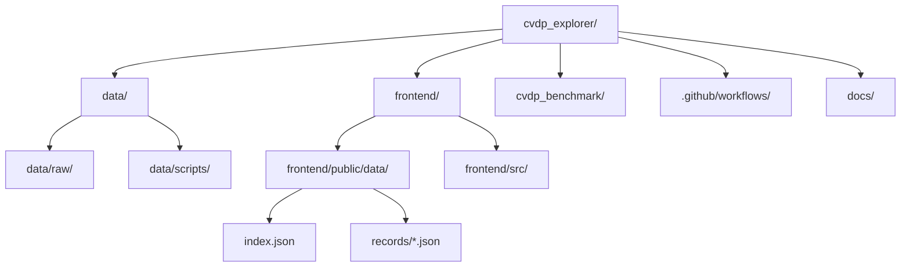
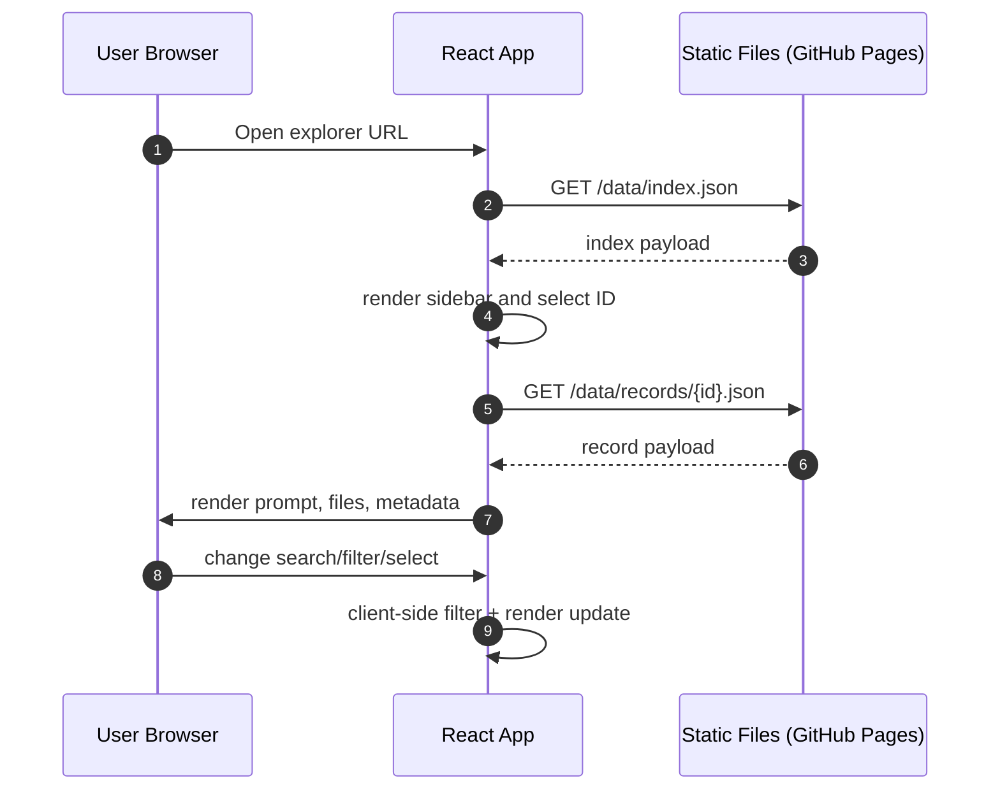
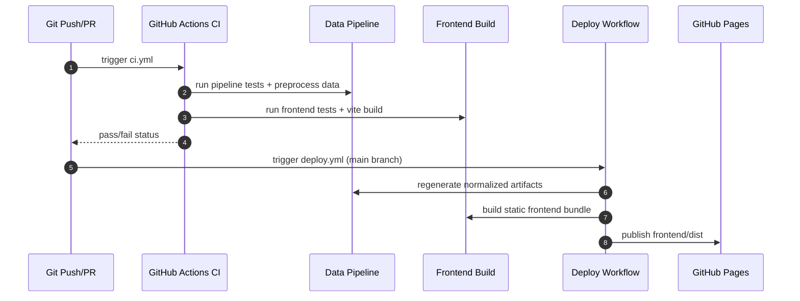

# Architecture Overview

## Goal

CVDP Explorer is a static site that makes the CVDP benchmark readable by transforming raw JSONL into a browser-friendly JSON format and rendering it in a React UI.

## High-Level Flow

1. Raw benchmark files live in `data/raw/*.jsonl`.
2. Preprocessor (`data/scripts/process_cvdp.py`) normalizes records.
3. Normalized output is written to `frontend/public/data/`.
4. Vite bundles the frontend from `frontend/`.
5. GitHub Actions deploys `frontend/dist` to GitHub Pages.

The pipeline is intentionally one-way and static: preprocess once, then serve immutable assets.

## Repository Structure

- `data/raw/`: upstream JSONL input files.
- `data/scripts/`: preprocessing code and tests.
- `frontend/`: Vite + React TypeScript app.
- `cvdp_benchmark/`: upstream NVlabs benchmark submodule.
- `.github/workflows/`: CI/CD workflows.
- `docs/`: implementation and maintenance documentation.

This layout separates data generation (`data/`) from presentation (`frontend/`) and external benchmark internals (`cvdp_benchmark/`).

## Runtime Data Access Pattern

This keeps navigation fast: only one index request and per-record lazy fetches.

## CI/CD Build and Deploy Sequence

CI validates correctness, while deploy rebuilds artifacts to ensure published output is reproducible from source.

## Design Principles

- Keep preprocessing deterministic and testable.
- Keep browser payload light with an index + lazy-loaded record files.
- Keep behavior explicit when expected outputs are redacted.
- Keep deployment static and reproducible.

For deployment operations and troubleshooting, see `docs/DEPLOYMENT.md`.
