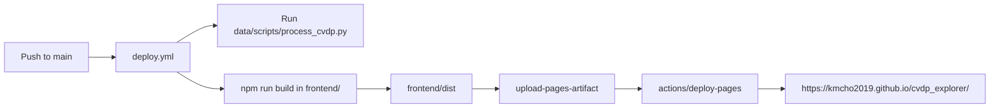

# Deployment Guide

This guide covers both GitHub Pages deployment and local deployment options.

## 1. Deployment Architecture



## 2. GitHub Pages Deployment

### 2.1 One-time repository setup

1. Open repository settings in GitHub.
2. Go to `Settings -> Pages`.
3. Under source/deployment, select `GitHub Actions`.
4. Confirm Actions are enabled for the repository.

### 2.2 What triggers deployment

`/.github/workflows/deploy.yml` runs on:

- pushes to `main`
- manual trigger (`workflow_dispatch`)

### 2.3 What the workflow does

1. Checks out repository with submodules.
2. Installs uv/Python + Node toolchains.
3. Syncs Python tooling via `uv sync`.
4. Runs preprocessing (`uv run python data/scripts/process_cvdp.py`).
5. Builds frontend bundle (`npm run build` in `frontend/`).
6. Verifies Pages artifact layout:
   - `frontend/dist/index.html` exists
   - `frontend/dist/data/index.json` exists
   - asset prefix matches expected Pages base path
7. Uploads `frontend/dist` as Pages artifact.
8. Deploys artifact to GitHub Pages.

### 2.4 Verify deployment

1. Open the `Actions` tab and confirm `Deploy CVDP Explorer` succeeded.
2. Open the environment link from the `deploy` job output.
3. Verify the site loads and records appear in the sidebar.
4. In browser devtools network tab, confirm `data/index.json` returns HTTP 200.

Live site URL for this repository:

- <https://kmcho2019.github.io/cvdp_explorer/>

## 2.5 Google Search Console ownership verification (HTML file method)

This repository uses the URL-prefix property:

- `https://kmcho2019.github.io/cvdp_explorer/`

Verification file handling:

1. Download the verification file from Google Search Console (for this repo it is currently `googlea2df242e632476d2.html`).
2. Place it under `frontend/public/` so Vite copies it to `frontend/dist/` during build.
3. Commit and push the file.
4. Wait for the Pages deployment workflow to finish.
5. Confirm the file is reachable at:
   - <https://kmcho2019.github.io/cvdp_explorer/googlea2df242e632476d2.html>
6. Click `Verify` in Search Console.

Important:

- Keep the verification file in the repository after verification; removing it can invalidate ownership.

## 3. Local Deployment Options

### 3.1 Local option A: development server (fast iteration)

Use this while editing UI and logic.

```bash
cd frontend
npm install
npm run dev
```

Default URL: `http://localhost:5173/`

### 3.2 Local option B: production preview via Vite

Use this to validate the production bundle behavior.

```bash
cd frontend
npm install
npm run build
npm run preview -- --host --port 4173
```

Preview URL: `http://localhost:4173/`

### 3.3 Local option C: static file hosting simulation

Use this to validate plain static hosting behavior.

```bash
cd frontend
npm run build
cd dist
python -m http.server 4173
```

URL: `http://localhost:4173/`

### 3.4 Local option D: GitHub Pages base-path simulation

The Vite config sets `base` from `GITHUB_REPOSITORY` for build output:

- project Pages repo (`owner/repo`) -> `/<repo>/`
- user/org Pages repo (`owner/owner.github.io`) -> `/`

To simulate project Pages path routing locally:

```bash
cd frontend
GITHUB_REPOSITORY=owner/repo npm run build
npm run preview -- --host --port 4173
```

Then open:

- `http://localhost:4173/<repo>/`

This helps catch path issues before pushing to `main`.

To simulate user/org Pages root routing:

```bash
cd frontend
GITHUB_REPOSITORY=owner/owner.github.io npm run build
npm run preview -- --host --port 4173
```

## 4. Recommended Pre-Deploy Checklist

From repo root:

```bash
curl -LsSf https://astral.sh/uv/install.sh | sh
git submodule update --init --recursive
uv sync --group dev
uv run ruff check data/scripts
uv run ty check data/scripts
uv run pytest -q data/scripts/tests
uv run python data/scripts/process_cvdp.py
cd frontend
npm ci
npm test
npm run build
```

Post-build SEO smoke checks:

```bash
test -f frontend/dist/robots.txt
test -f frontend/dist/sitemap.xml
test -f frontend/dist/googlea2df242e632476d2.html
```

## 5. Basic SEO baseline for GitHub Pages

Current baseline in this repository:

- `frontend/index.html` includes description, canonical URL, robots directive, Open Graph, Twitter, and WebSite JSON-LD metadata.
- `frontend/public/robots.txt` allows crawling and points to sitemap.
- `frontend/public/sitemap.xml` declares the public explorer URL.

Recommended Search Console actions:

1. Verify ownership (section 2.5).
2. Submit `https://kmcho2019.github.io/cvdp_explorer/sitemap.xml` in Search Console Sitemaps.
3. Use URL Inspection on `https://kmcho2019.github.io/cvdp_explorer/` and request indexing after major updates.

## 6. Common Issues and Fixes

### 5.1 Blank page or missing assets on GitHub Pages

Likely cause:

- incorrect base path assumptions

Check:

- repository name matches expected path in URL (`/<repo>/`)
- production build was created in workflow with `GITHUB_REPOSITORY` available

### 5.2 `data/index.json` returns 404 in deployed site

Likely cause:

- preprocessing step failed or artifact did not include generated files

Check:

- `deploy.yml` build logs for `uv run python data/scripts/process_cvdp.py`
- artifact contents include `frontend/dist/data/index.json`

### 5.3 Submodule-related failures in CI/CD

Likely cause:

- submodule fetch issue or detached upstream reference mismatch

Check:

- checkout step includes `submodules: recursive`
- submodule pointer in main repo is valid and committed

### 5.4 Site not updating after successful deploy

Likely cause:

- browser cache

Fix:

- hard refresh (`Ctrl+Shift+R`)
- open in incognito/private mode
